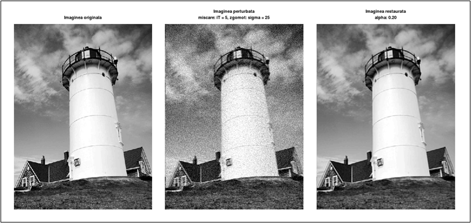
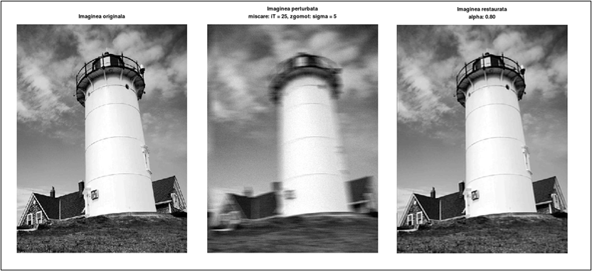
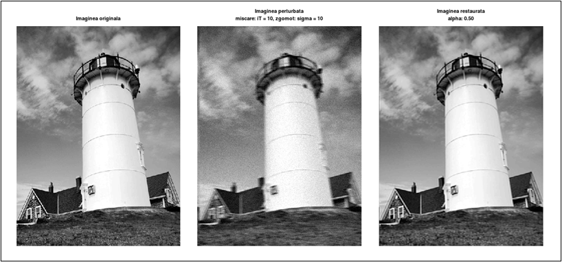

# Image Restoration - Geometric Mean Filter

A project implementing the **Geometric Mean Filter** for image restoration in MATLAB/Octave. This technique is used to recover images degraded by motion blur and noise, improving their clarity and quality.

## Features

- **Restores images affected by motion blur and noise** using the Geometric Mean Filter.
- **Customizable parameters** for adjusting blur intensity, noise level, and filter strength.
- **Implemented in MATLAB/Octave** for efficient computation and visualization.

## Getting Started

Follow these steps to set up and run the project on your local machine.

### Prerequisites

- MATLAB or GNU Octave (recommended for compatibility).

### Installation

Clone the repository using:

```bash
git clone https://github.com/galbinasuana/Image-Restoration.git
```

## Usage

### Restoring a Degraded Image

1. Open `filtru_medie_geometrica_cd.m` in MATLAB/Octave.
2. Select an input image (e.g., `lighthouse.jpg`).
3. Define the parameters for degradation and restoration:
   - `iT` (motion blur intensity)
   - `sigma` (noise level)
   - `alpha` (filter strength between inverse and Wiener filters)
4. Run the script to apply the restoration technique.
5. The script will display and save three images:
   - **Original image**
   - **Degraded image (motion blur + noise)**
   - **Restored image (after applying the filter)**

## Example Results

### Case 1: Weak Motion Blur and High Noise

**Parameters:** `iT = 5, sigma = 25, alpha = 0.20`

**Original vs. Degraded vs. Restored Image**  


### Case 2: Strong Motion Blur and Low Noise

**Parameters:** `iT = 25, sigma = 5, alpha = 0.80`

**Original vs. Degraded vs. Restored Image**  


### Case 3: Equal Motion Blur and Noise Levels

**Parameters:** `iT = 10, sigma = 10, alpha = 0.50`

**Original vs. Degraded vs. Restored Image**  
